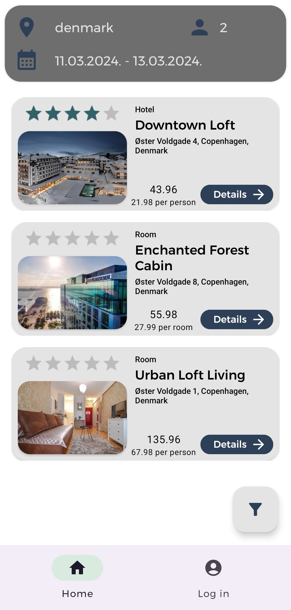
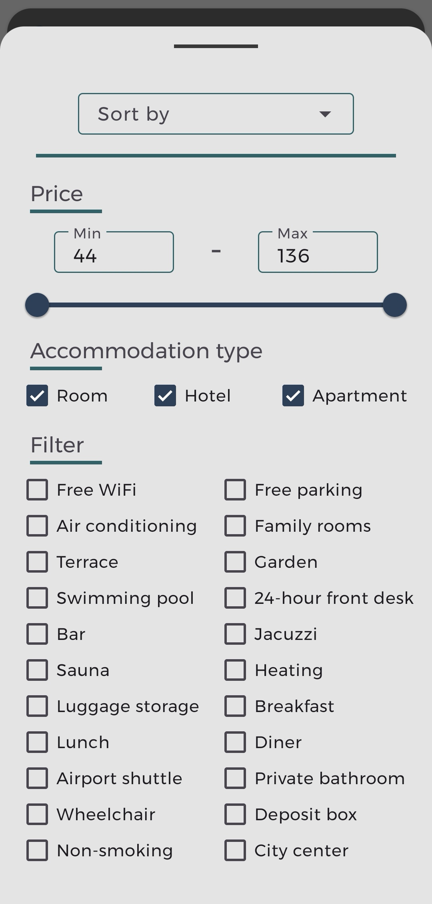
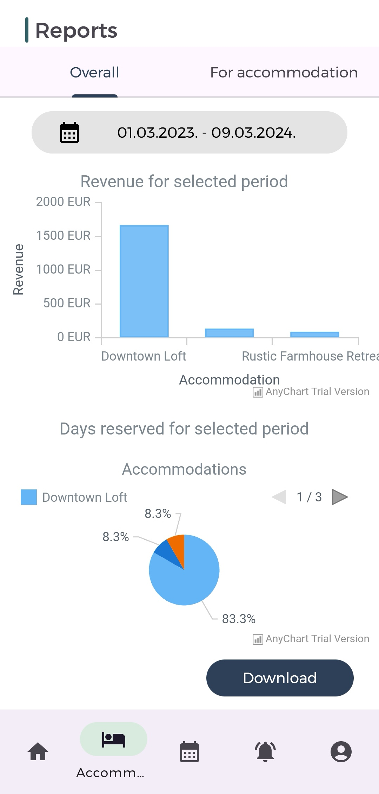
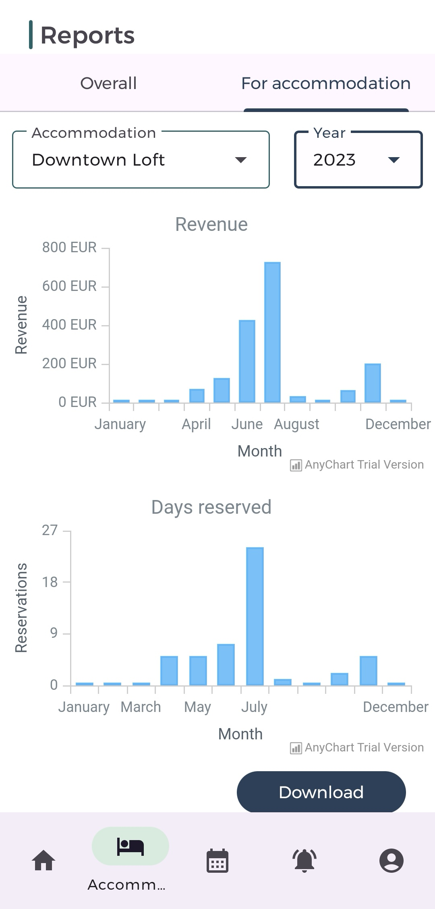

# Bookify mobile

Bookify is a powerful accommodation booking Android application developed using Android Studio and several key technologies. It offers a robust platform for users to seamlessly book accommodations, with features such as real-time availability and recommendations.

## Course Information
This project is part of the coursework for the course "Mobilne aplikacije" (Mobile applications) at [Fakultet Tehničikih Nauka](https://www.ftn.uns.ac.rs/). The goal of the project is to apply the concepts learned during the course and showcase practical skills in developing Android application.

## Preview of Key Features

### Home

View top accommodations and locations to get an inspiration for your next trevel.

<p align="center">
  
</p>

### Searching and Filtering Accommodations

Effortlessly find the perfect accommodation with our advanced search and filtering options, including:

- **Location**
- **Availability Date**
- **Number of Persons**
- **Price**
- **Amenities**
- **Accommodation Type**

<p align="center">
  
  
  
</p>

### Accommodation Details

Explore comprehensive details about accommodations, including:

- **Slideshow of Pictures**
- **Detailed Descriptions**
- **Option to Reserve (for logged-in guests)**
- **User Comments and Reviews**

<p align="center">
  
  
  
</p>

### Reports

Stay informed about the performance and status of your accommodations effortlessly.
Generate insightful reports and download them, including two types:

- **By Accommodation**
- **By Period**

<p align="center">
  
  
</p>

### Requests Management

Efficiently manage reservation requests with easy filtering options and status updates.


---

## Getting Started

These instructions will get you a copy of the project up and running on your local machine for using, development and testing purposes. 

### Prerequisites

- Android Studio
- [Server](https://github.com/SIIT-Team-3/Bookify-server)
- [Client](https://github.com/SIIT-Team-3/Bookify-client)

### Installing

Clone the repository

```shell
git clone https://github.com/SIIT-Team-3/Bookify-mobile
```

## Usage

Open project in Android Studio. Make sure to set ip_addr in local.properites to your ip address (where the server is running), as well as `IP_ADDRESS` in `UserControler` in [Server](https://github.com/SIIT-Team-3/Bookify-server), `apiMobile` in `env` in [Client](https://github.com/SIIT-Team-3/Bookify-client) and run the Client whit `ng serve --host 0.0.0.0` . You can now press run and start an application.

## Authors

* Student 1 -  Miloš Bojanić - *SV9/2021* - [GitHub](https://github.com/milosbojanic)
* Student 2 - Aleksa Vukomanović - *SV66/2021* - [GitHub](https://github.com/aleksaaaa02)
* Student 3 - Olivera Radovanović - *SV46/2021* - [GitHub](https://github.com/Olivera2708)
